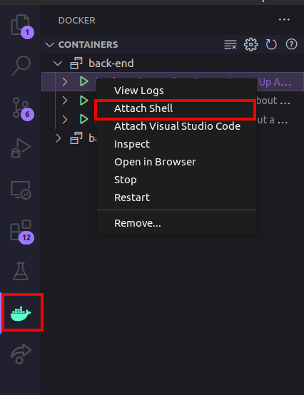

# Variaveis de ambiente

## Configurando o ambiente:

Para que a aplicação rode conforme o esperado, é necesário:

- Visual Studio Code;
- Prisma extension ;
- Docker compose;

1 - Copie o arquivo _"raiz.env"_ para a pasta backend e altere o nome do arquivo para _".env"_

2 - Rode o comando:

``` cd back-end && docker compose up ```

Isso deve iniciar a aplicação back-end corretamente.

Aguarde enquanto o docker cria os conteiners.

Após a criação dos containers você verá no console uma mensagem dizendo:

<code>Server is running on port: XXXX</code>

3 - Execute as migrates do Banco

Utilizando a estenção "Docker" no Visual Code clique com o botão direito no container app 



No terminal que aparecerá digite o comando 

<code>npx prisma migrade dev</code>

Esta etapa irá criar todas as tabelas e camapos necessárias no banco de dados. 

4 - abra um novo terminal, entre na pasta front-end e inicie a aplicação com o comando: 

<code>npm run dev</code>

PRONTO!! 


